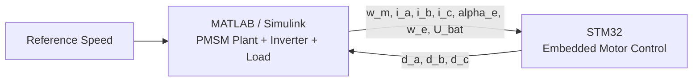

# ⚡ MotorDrive: Embedded Motor Control HIL with STM32, MATLAB, and Simulink

# Hi, I'm building an embedded motor control project

### Embedded software development for motor control applications using an STM32 controller and a MATLAB/Simulink plant model

### Focused on applying control engineering in practice, translating algorithms into efficient embedded code, and validating control performance in a Hardware-in-the-Loop setup

## 📌 Project Overview

This project implements a **Hardware-in-the-Loop (HIL)** framework for **embedded motor control** using:

- **STM32** as the embedded controller
- **MATLAB / Simulink** as the model-based development and plant simulation environment
- **UART communication** between the microcontroller and the PC
- **PMSM control and FOC concepts** for developing and testing software for electric drive systems

The goal is to develop and implement embedded software for motor control applications, applying control engineering principles in practice and turning algorithms into real-world performance while the motor and inverter remain in simulation

---

## 🚀 Features

- Embedded software implementation for **motor control applications**
- **MATLAB / Simulink** based plant simulation and model-based development
- UART-based communication between STM32 and the host environment
- HIL-ready architecture for testing embedded control logic without physical motor hardware
- Support for:
  - speed control
  - current control
  - duty-cycle generation
  - electrical angle feedback
  - torque and speed observation
- Practical framework for:
  - implementing control algorithms
  - translating system and control concepts into software
  - analyzing, testing, and optimizing control performance

---

## 🧠 Control Concept

The project is based on a motor control loop where software and physical-system behavior are developed together:

- MATLAB / Simulink computes the plant dynamics
- STM32 receives measured signals from the simulated drive system
- STM32 executes the embedded control logic
- MATLAB / Simulink applies the resulting control action back to the PMSM model

Typical exchanged signals include:

- reference speed
- mechanical speed
- phase currents
- electrical speed
- electrical angle
- DC bus voltage
- duty cycles

This reflects a workflow at the **intersection of software and physical systems**, where control algorithms are implemented and evaluated as embedded software rather than simulation only

---

## 🏗️ System Architecture

## 🛠️ Technologies and Tools

- **C / C++**
- **MATLAB**
- **Simulink**
- **STM32CubeIDE**
- **STM32 HAL**
- **UART / VCP communication**
- **Embedded motor control**
- **PMSM modeling**
- **FOC concepts**
- **HIL testing**
- **Model-based development**

---

## 📂 Project Structure

**main.cpp**  
Embedded firmware running on STM32

**STM32PMSMAsciiBlock.m**  
MATLAB System block wrapper for Simulink UART communication

**MIL_Simulation.slx**  
Model-in-the-Loop simulation

**FieldOrientedControl.slx**  
FOC-related model blocks

**PlantModel.slx**  
PMSM and inverter plant model

---

## 🔁 Communication Flow

### MATLAB / Simulink → STM32

The simulated plant sends sampled feedback values such as:

- reference speed
- motor speed
- phase currents
- electrical angle
- electrical speed
- bus voltage

### STM32 → MATLAB / Simulink

The controller returns:

- phase duty cycles or control outputs

This allows the embedded controller to operate in closed loop on simulated electric-drive feedback while the software behavior is tested on real hardware

---

## 📊 Current Development Status

- UART communication between MATLAB and STM32 validated
- Basic HIL loop established
- Simulink integration in progress
- PMSM plant equations wrapped into MATLAB Function blocks
- Ongoing tuning and partitioning between:
  - controller on STM32
  - plant on MATLAB / Simulink

---

## ▶️ How to Run

### 1. Flash the STM32 firmware

Build and flash `main.cpp` using **STM32CubeIDE**

### 2. Connect the board

Use the STM32 virtual COM port over USB

### 3. Open MATLAB / Simulink

Make sure the correct COM port and baud rate are configured

### 4. Run the MATLAB host script or Simulink model

Start the HIL loop and observe:

- speed response
- current response
- torque
- duty cycles

---

## 🔬 What I am Learning Through This Project

- How to develop embedded software for motor control applications
- How to apply control engineering principles in practice
- How to translate control concepts into embedded implementation
- How to analyze, test, and optimize control performance
- How to combine model-based development with real embedded hardware
- How to work at the boundary between software and physical systems

---

## 📈 Future Improvements

- Move from ASCII protocol to binary UART protocol
- Reduce communication latency
- Use DMA / ring-buffer UART
- Increase control update rate
- Improve control-performance tuning
- Add logging and debugging tools
- Migrate more of the workflow into Simulink subsystems
- Extend the project toward a more production-ready embedded software structure
- Improve validation workflow for electric drive systems

---

## 📷 Example Outputs

This project monitors and evaluates:

- reference vs actual motor speed
- dq currents
- abc phase currents
- electromagnetic torque
- duty-cycle outputs

---

## 🎯 Project Goal

To build a clean and practical embedded motor control HIL platform that demonstrates how control engineering concepts can be transformed into efficient, reliable embedded software and validated through model-based development with MATLAB/Simulink

---

## 📬 Contact

GitHub: https://github.com/MusaabTaha/embedded-motor-control-stm32-matlab
LinkedIn: https://www.linkedin.com/in/musaab-taha-956bb7105/

Email: mosab_taha@hotmail.com

---

## ⭐ Notes

This project is intended for learning and experimentation in:

- embedded systems
- motor control
- HIL simulation
- MATLAB / Simulink integration
- STM32 firmware development
- model-based development
